## Locale
- [EN](Docs_EN.md)

## Docs
- [Usage Documentation](Docs_EN.md)
- [Scripting API](Scripting_EN.md)
- [Listener API](Listeners_EN.md)
- [Extension API](Extension_EN.md)

<br/>

The save manager is a flexible & modular save system for the Unity game engine with a
built-in save editor to edit the save without needing to open the save file itself.

## Contents
- [Dependencies](#dependencies-)
- [Initial Set-up](#initial-set-up-)
- [Asset Settings](#asset-settings-)
- [Navigation Menu Options](#navigation-menu-options-)
- [Save Objects](#save-objects-)
- [Save Values](#save-values-)
- [Save Locations](#save-locations-)
  - [Editor Save](#editor-save-)
- [Save Structure](#save-structure-)
  - [Json Converters](#json-converters-)
  - [Meta data](#meta-data-)
- [Save Editor](#save-editor-)
  - [Save Object & Values GUI](#save-object--values-gui-)
  - [Save Categories](#save-categories-)
  - [Save Slots](#save-slots-)
  - [Reset Save Data](#reset-save-data-)
- [Save Captures](#save-captures-)
- [Save Backups](#save-backups-)
- [Save Encryption](#save-encryption-)
- [Legacy (2.x) Save Porting](#legacy-2x-save-porting-)
- [Pre Data Load Intercept](#pre-data-load-intercept-)
- [Json Parsing](#json-parsing-)
- [Support](#support-)
  - [Help](#help-)
  - [Bug Reporting](#bug-reporting-)

<br/>

## Dependencies [^](#contents)
The save manager requires the `Newtonsoft Json` package to function. This can be added
to your project for free by adding the following package in the package manager from
inside a Unity project: 

```
com.unity.nuget.newtonsoft-json
```

If you are in an older version of unity such as the 2020.3.x this package is not shown in the
package manager. To add it just enter the above package string via the add from git url
option in unity’s package manager to add it to the project.

<br/>

## Initial Set-up [^](#contents)
There isn’t any set-up steps bar importing the package. Any required steps are
automatically handled for you. All you need to do is define the save data so the asset can
save it for you.

<br/>

## Asset Settings [^](#contents)
All the asset settings can be found in the project settings menu under:

```
Project Settings > Carter Games > Save Manager
```

The settings can also be accessed under the navigation menu item:

```
Tools > Carter Games > Save Manager > Edit Settings
```

A run-down of all the available settings below:

| Category             | Settings              | Type                                     | Description                                                                                                                                                                                                        |
|:---------------------|:----------------------|:-----------------------------------------|:-------------------------------------------------------------------------------------------------------------------------------------------------------------------------------------------------------------------|
| Asset Version Info   | Check for updates     | Button                                   | Checks an API, hosted by Carter Games, to see if there is an update to the asset. The result is returned to you in an editor dialogue.                                                                             |
| General              | Show debug logs       | Boolean                                  | Toggles if the asset shows any intended debug log messages in the console.                                                                                                                                         |
| General              | Show dev logs         | Boolean                                  | Toggles if the asset shows more detailed developer logs that can help diagnose issues with the asset.                                                                                                              |
| Save Settings        | Auto save on exit?    | Boolean                                  | Toggles if the asset will try to save the game on exiting the game.                                                                                                                                                |
| Save Settings        | Use json converters   | Boolean                                  | Toggles if the asset uses its own built-in converters for specific edge cases like Vectors etc.                                                                                                                    |
| Save Settings        | Save location         | ISaveDataLocation (Search assigned)      | Defines the active save location the asset will use for your game save.                                                                                                                                            |
| Save Settings        | Editor save file      | Read-only path + Buttons                 | Gives options to show the editor save folder & file to view. You cannot change the path of the editor save.                                                                                                        |
| Save Slots           | Use save slots        | Boolean                                  | Defines if the save slots system is enabled or not.                                                                                                                                                                |
| Save Slots           | Limit available slots | Boolean                                  | Defines if the number of save slots the set-up can make is limited or not.                                                                                                                                         |
| Save Slots           | Max user save slots   | Int (Slider)                             | Only available if Limit available slots is enabled. Defines the number of slots the set-up can produce.                                                                                                            |
| Save Meta Data       | Game info             | Boolean                                  | Defines if the game info meta data the asset provides if used or not.                                                                                                                                              |
| Save Meta Data       | System info           | Boolean                                  | Defines if the system info meta data the asset provides if used or not.                                                                                                                                            |
| Backup Settings      | Total save backups    | Int (Slider)                             | Defines the number of save backups the system will generate whenever it successfully loads a save data different to the last backup.                                                                               |
| Backup Settings      | Backup save location  | IBackupSaveLocation (Search assigned)    | Defines the save location for the save backups to be stored at.                                                                                                                                                    |
| Encryption Settings  | Encrypt save          | Boolean                                  | Defines if the save content is encrypted or not. <b>NOTE:</b> Only data under the `$content` tag is encrypted.                                                                                                     |
| Encryption Settings  | Encryption handler    | ISaveEncryptionHandler (Search assigned) | Defines the encryption handler used to encrypt the game save content. <b>WARNING:</b> If making a custom handler, make sure you test your encryption option before assigning it here to avoid a loss of save data. |
| Legacy Save Settings | Port legacy save?     | Boolean                                  | Defines if the asset will try to port a legacy 2.x save.                                                                                                                                                           |
| Legacy Save Settings | Legacy save handler   | ILegacySaveHandler (Search assigned)     | Defines the handler used for the legacy save porting setup.                                                                                                                                                        |

<br/>

## Navigation Menu Options [^](#contents)
The nav menu gives you some quick asset to useful features as well as the assets editor
windows etc.

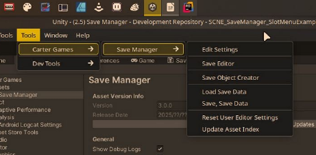

| Option | Description                                                                                           |
| :----- |:------------------------------------------------------------------------------------------------------|
| Edit Settings | Opens the settings if it is not already focused on in the editor.                                     |
| Save Editor | Opens the save editor window to let you access and edit the save data from the editor.                |
| Save Object Creator | Opens a GUI popup to aid in the creation of Save Object classes.                                      |
| Load Save Data | Loads the current save location manually.                                                             |
| Save, Save Data | Saves the current save state to the save location.                                                    |
| Reset User Editor Settings | Resets any per-user settings related to the asset to their default values.                            |
| Update Asset Index | Updates the assets asset lookup in-case of any issues. Should be ignored, but is there for debugging. |

<br/>

## Save Objects [^](#contents)
A save object is basically a scriptable object that can store save values on it. When
defined the save values on each object can be access in the editor and at runtime with
ease. To make a save object you just need to make a class that implements the
`SaveObject` class, or `SlotSaveObject` class if you want the data to be specifically used in
save slots.

You can do this manually by making a class that inherits from the SaveObject classes or
you can use the built-in SaveObject maker GUI. This can be found under:

```
Tools > Carter Games > Save Manager > Save Object Creator
```

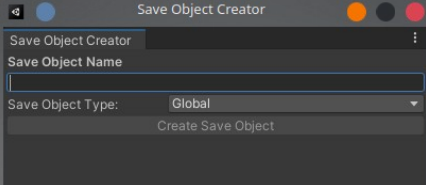

The save object creator window has a really simple set-up. You first enter the name of the
class you want to make into the `Save Object Name` field on the GUI. Then if you have the
Save Slots feature enabled you’ll be able to select between a `global` or `slot` save object. If
not then it’ll be global by default behind the scenes and the option will be hidden from you.

Then all you need to do is press the `Create Save Object` button and choose where in the
project’s assets folder the class should go. Once you confirm the location for the class it
will be generated automatically for you.

All correctly set-up save values can be viewed in the `Save Editor` window. Either under
the `Global Data` or `Save Slots` tab dependent on which `Save Object` class it is under. An
example from the example save data:

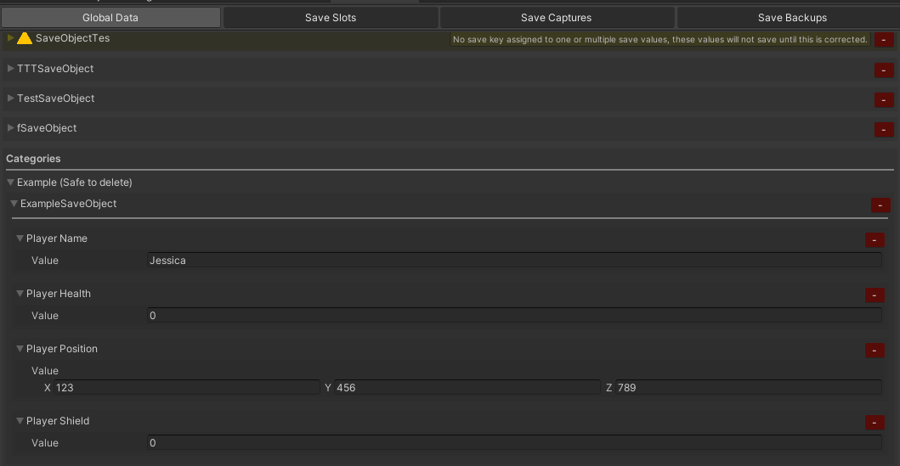

<br/>

## Save Values [^](#contents)
A save value defines an entry in the game save. You define save values by using the generic save value class `SaveValue<T>` as a field on in a `SaveObject` class. A valid save value **MUST**:
- Be placed inside a class that inherits from `SaveObject`/`SlotSaveObject`, if not it will not function correctly.
- Be of a serializable type.
- Have a uniquely defined save key.

You have the option to also define a default value for the save value if you wish, but this is totally optional.

An example of a defined save value below:

```csharp
[SerializeField] private SaveValue<int> lastTimestamp = new SaveValue<int>("lastTime");
```

<br/>

## Save Locations [^](#contents)
The asset provides a couple different save locations to use. These are:

| Location | Description                                                                          | 
| :------- |:-------------------------------------------------------------------------------------|
| Local File | Stores the save data in a file in the application persistent data path.              |
| Player Prefs | Stores the save data in Player prefs, but split into chunks so it can all be saved.  |

<br/>

You can define custom storage locations should you wish by implementing the following interfaces into your own classes:

| Interface         | Description                                                                          |
|:------------------|:-------------------------------------------------------------------------------------|
| IDataLocation     | To define a location where data can be saved to or loaded from.              |
| ISaveDataLocation | To define a DataLocation that can be used to save/load the game save data specifically.  |

<br/>

You can change the location that is used in the asset settings at any time. 
However, if you have a released product, it is advised you keep the same location throughout to avoid 
any issues with changing between the different locations. 
A change in location will be handled on the next load if the previous is different to the currently set.

<br/>

### Editor Save [^](#contents)
The editor has a separate save file to your built runtime. This is so you can edit the save in
the editor freely without conflict with a build version of your game on the same machine.
The editor save will be stored in your projects persistent data path under the `/EditorSave`
folder. This can be accessed from the asset settings open folder option next to the editor
save path label:

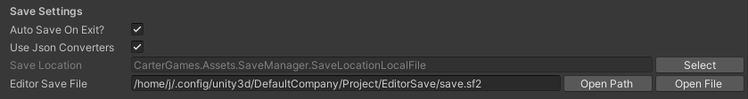

The editor save will update on certain conditions to avoid performance hits when making edits. These are:
- Saving the project.
- Closing Unity.
- Entering play mode (pressing play in the editor).
- Script recompilation.

The editor save will also only save when there are changes to be saved.

<br/>

## Save Structure [^](#contents)
The 3.x save structure divides the content of the save into a few different sections. The
main game save is stored under the `$content` tag. It is then split the following:

| Tag     | Description                                                                         |
|:--------|:------------------------------------------------------------------------------------|
| `$global` | Any game save data that is not used for the save slots system.                      |
| `$slots`  | Sores info about the slots system as well as the data for all the slots themselves. |

There is also an additional section under the `$metadata` tag which stores read-only info for
context about the game & the users system which are completely optional.

Each save value defined is split into a object with 3-4 tags per entry. These are:

| Tag      | Description                                                                   |
|:---------|:------------------------------------------------------------------------------|
| `$key`   | Defines the key the save system has defined for the value.                    |
| `$value` | Holds the Json value.                                                         |
| `$type` | The type the save value is.                                                   |
| `$default` | Defines the custom default value for the save value. Only appears if defined. |

An example:

```json
{
  "$key": "examplePlayerHealth",
  "$value": 6,
  "$type": "System.Int32",
  "$default": 10
}
```

An example of a populated save data from the simple sample scene below:

```json
{
  "$content": {
    "$global": [
      {
        "$key": "examplePlayerName",
        "$value": "Bob",
        "$type": "System.String"
      },
      {
        "$key": "examplePlayerHealth",
        "$value": 50,
        "$type": "System.Int32"
      },
      {
        "$key": "examplePlayerPosition",
        "$value": {
          "x": 1.0,
          "y": 2.0,
          "z": 3.0
        },
        "$type": "UnityEngine.Vector3"
      },
      {
        "$key": "examplePlayerShield",
        "$value": 5,
        "$type": "System.Int32"
      }
    ]
  },
  "$meta_data": {
    "$game_info": {
      "$version": "0.1",
      "$save_date": "2026-01-09T18:52:31"
    },
    "$system_info": {
      "$os": "Linux 6.17 Fedora Linux 43 64bit",
      "$cpu": "AMD Ryzen 7 5800X 8-Core Processor",
      "$ram": "32006MB",
      "$gpu": "AMD Radeon RX 6800 (radeonsi, navi21, LLVM 21.1.5, DRM 3.64, 6.17.12-300.fc43.x86_64) (13436MB)"
    }
  }
}
```

<br/>

### Json Converters [^](#contents)
The save manager set-up automatically saves any serializable fields which are either:
- public exposed fields
- [SerializeField] private fields

These values need to also be serializable in Unity for them to be saved.

This is a custom set-up that only select fields as the standard set-up for Newtonsoft Json,
which the asset uses for its Json set-up, is to serialize both fields and properties. You can
freely edit the Json of any of your custom types by making a converter class that inherits
from the `SmJsonConverterBase<T>` class.

<br/>

### Meta-data [^](#contents)
Meta-data is extra data that is added to a separate section of the game save. The purpose
is to show important info such as game version & basic system info to aid with debugging
etc. This section of the save is never encrypted, so it is always readable. If no meta-data
can be written to the save then the section will be omitted from the save entirely.

The asset has two default implementation that are enabled by default. You can disable
them in the asset settings with a simple toggle for each one.The GameInfo meta-data
class displays the save date & version number from the player settings. While the
SystemInfo meta-data displays the OS/CPU/RAM/GPU info of the users system.

You can easily make your own meta-data set-ups to add to the save by making a new
class that implements the `ISaveMetaData` interface.

<br/>

## Save Editor [^](#contents)
The save editor is the intended way for you to edit the save of your game. You can open
the save editor window from the navigation menu’s **Save Editor** option.

```
Tools > Carter Games > Save Manager > Save Editor
```

The save editor is split into 4 tabs:

| Tab         | Description                                                                                                   |
|:------------|:--------------------------------------------------------------------------------------------------------------|
| Global Data | Displays all the global save objects and their save values.                                                   |
| Save Slots | Displays all the save slots currently defines in the save and their save objects / save values.               |
| Save Captures | A tool to help you store particular save files as a backup you can reload into your current save at any time. |
| Save Backups | Lets you view the current save backups and make save captures from any backup should you wish.                |

<br/>

### Save Object & Values GUI [^](#contents)
In the save editor GUI each save object is its own drop-down group labelled the save as
the save objects class name. If there are any issues with a save value under a save object
you will see a warning GUI over it like so:

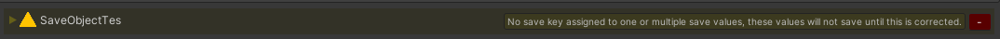

When you expand a save object in the editor you’ll see drop-downs for all the save values
defined on that save object. Expanding any of these will reveal the value currently stored
on that save value for you to edit:

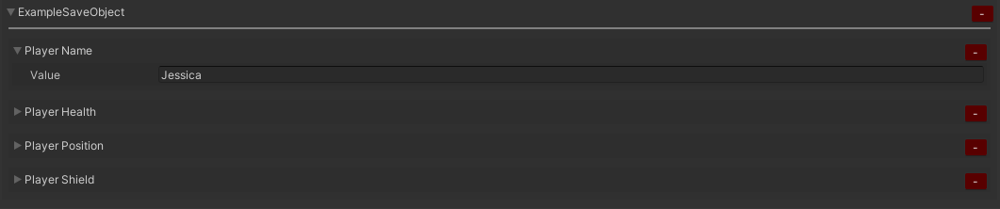

Any edits made to save values here will apply when the editor save next updates. You can
press the red minus button next to and save object or save value to reset it to its default
value. You will be asked through an editor dialogue to confirm this action.

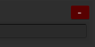

<br/>

### Save Categories [^](#contents)
Any save objects that are defined with the `SaveCategory` attribute on them will appear
under the categories section instead of the uncategorized section above it. If multiple save
objects are in the same category, they will appear together under the same drop-down.

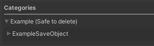

<br/>

### Save Slots [^](#contents)
Save slots are displayed with each slot being its own drop-down in the save slot stab.
Slots will have the last time they were saved as well as their total active playtime stored as
read-only data in the save editor. These are just slot data the asset automatically stores for
each slot and you should need to touch them. Underneath you’ll see the save data drop-down
which matches when expanded works just like the global tab with save object / save
values for that slot appearing underneath for editing.

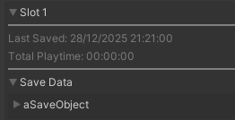

You can reset the meta-data for a slot with the relevant button on the slot.

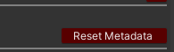

Pressing the red minus button on the slot itself will delete the slot completely. You will be
prompted to confirm this action. You can also add new slots in the editor with the add slot
button. Note that at runtime a user will not have any slots. This only works for editor
purposes to aid with testing etc.

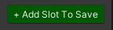

<br/>

### Reset Save Data [^](#contents)
You can reset all save data from the global or slots tabs in the save editor. There is a big
reset save button at the bottom of the GUI. You will be prompted to confirm this action
before it is performed.

<br/>

## Save Captures [^](#contents)
Save captures are save files that are stored in a text file in the project for you to load from
at any time. They are good for when you need a backup of a game save state the can be
shared and tested with in the editor.

All save captures are stored at the following hard-coded directory:

```
Assets > Plugins > Carter Games > Save Manager > Captures
```

You can make captures from the **save editor**

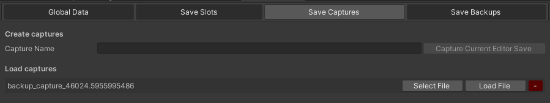

Here you can make new captures and manage them. You can make a capture of the
current editor save with the top GUI. Simply enter a name for the capture and press the
create capture button.

The remaining GUI will show a list of all the save captures in the project. Each capture will
display the following options:

| Option      | Description                                                                        |
|:------------|:-----------------------------------------------------------------------------------|
| Select File | Selects the capture file in the project tab.                                       |
| Load File   | Will attempt to load the capture in to the editor save data.                       |
| -           | Deletes the capture from the project. You will be prompted to confirm this action. |

<br/>

## Save Backups [^](#contents)
The asset will automatically store one or several backups of your save data when it loads
without errors when the data is different to the last stored in a backup. In the event a save
fails to load it will instead try to load a backup. If all backups fail to load you’ll get an
`GameLoadFailed (1210)` error code.

You can view save backups from the editor with the save editor window in the save
backups tab:

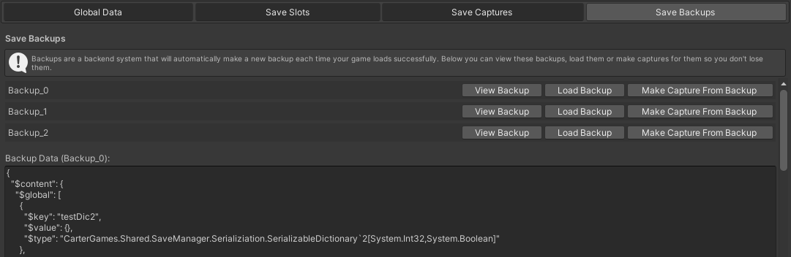

Here you can view the backups and perform a few actions:

| Option                   | Description                                                                                    |
|:-------------------------|:-----------------------------------------------------------------------------------------------|
| View Backup              | Displays the backup save data in the GUI to view.                                              |
| Load Backup              | Tries to load the backup as the current save data in the editor.                               |
| Make Capture From Backup | Tries to make a save capture from the backup data so it is not lost when new backups are made. |

<br/>

## Save Encryption [^](#contents)
You can encrypt the save content with the built-in set-up. This will encrypt the
content data only. So meta-data will still be readable as this is intended for read-only info.
By default, this set-up is disabled.

The asset provides a super basic AES encryption handler to encrypt the save if you
wish. This isn’t super secure and any determined attacker will easily get through it.
The average user would not be able to read the save right away though.

You can also implement your own encryption set-up by making a class that
implements the `ISaveEncryptionHandler` interface. This is recommended if you
want a more secure save as I cannot package the best solutions without adding
more dependencies or more complex set-ups.

<br/>

## Legacy (2.x) Save Porting [^](#contents)
The asset comes with a basic set-up that should port and 2.x save data into 3.x global
save data where the keys & types match between versions. It won’t work for slot save data
due to the legacy set-up not supporting such a feature.

The set-up will try to port a legacy save if one is found and then move it once processed to
a legacy location as a backup. This set-up is enabled by default, but can be disabled in the
asset settings.

If you want to add your own implementation of a porting of your 2.x save data, you can
make a class implementing the `ILegacySaveHandler` interface.

<br/>

## Pre Data Load Intercept [^](#contents)
You can add logic before the game loads new data from the save by making a class that
implements the `IPreSaveDeserialize` interface. This lets you edit the Json from the save
before it is converted into Json object to load it into the game. This is mainly useful for
porting older save set-ups to new structures etc. Using this set-up is risky as it can break
the loading process easily. Use at your own risk.

<br/>

## Json Parsing [^](#contents)
The asset is using the standard **_Newtonsoft Json_** parsing for Json with a few custom
edits. These being:
- Only public or [SerializeField] private fields will be captured by the save manager for
  the game save.
- Unless turned off by the Use Json Converters asset setting, the asset will use its
  own json converters to make a readable json of the following types:
  - Vector2
  - Vector2Int
  - Vector3
  - Vector3Int
  - Vector4
  - Color
  - Color32
  - Quaternion
- You can add your own for any type using the save managers base class for json
  converters to make it easier to write. See `SmJsonConverterBase` for more info
  on this.

<br/>

## Support [^](#contents)
### Help [^](#contents)
I try to respond to queries as within 24 hours, but I am only 1 person. So bear with me if I don’t
mange this. I may be busy. Should you need any help with the asset, you can reach me by the
following channels:
- General contact form: https://carter.games/contact/
- Direct email: [hello@carter.games](mailto:hello@carter.games?subject=Save Manager 3.x Help)

### Bug Reporting [^](#contents)
Found an issue? Report it via the following channels. Bugs will be corrected as soon as possible if
deemed major. Minor issues may take a little time to resolve. I do this for free after all:
- Bug reporting form: https://carter.games/report/
- GitHub Issues: https://github.com/CarterGames/SaveManager/issues
- Direct email: [hello@carter.games](mailto:hello@carter.games?subject=Save Manager 3.x Bug Report)